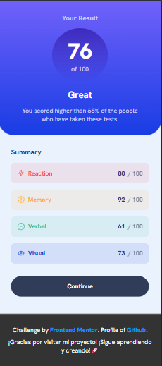
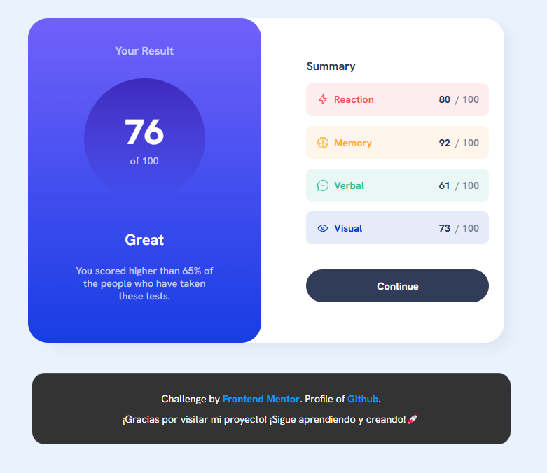

# Results Summary Component

## 📝 Descripción

Este proyecto es un componente de resumen de resultados que muestra puntuaciones de pruebas de manera interactiva y visualmente atractiva. Está diseñado para ser completamente responsive, con diseños adaptados tanto para móviles como para escritorio. Los datos se cargan dinámicamente desde un archivo JSON.

## ✨ Características principales

- **Diseño responsive:** Compatible con móviles y escritorio.

- **Carga dinámica de datos:** Los resultados se cargan desde un archivo JSON.

- **Estados interactivos:** Efectos hover en botones y elementos interactivos.

- **Visualización de puntuaciones:** Fondos con gradientes para una presentación moderna.

- **Desglose por categorías:** Muestra resultados detallados por cada categoría.

## 🛠️ Tecnologías utilizadas

- **_HTML:_** Estructura semántica del componente.

- **_CSS:_** Estilos avanzados con Flexbox y gradientes.

- **_JavaScript:_** Uso de Fetch API para cargar datos dinámicos.

- **_Google Fonts:_** Fuente Hanken Grotesk para un diseño moderno.

## 🚀 Instalación

Sigue estos sencillos pasos para ejecutar el proyecto en tu entorno local:

1. **Clona este repositorio**:
   Abre tu terminal y ejecuta el siguiente comando:

   ```bash
   git clone https://github.com/ImBenja/results-summary-component.git

   ```

2. **Navega al directorio del proyecto**:

   ```bash
   cd results-summary-component

   ```

3. **Abre el archivo index.html en tu navegador**:
   Puedes hacerlo doble clic en el archivo o arrastrarlo a tu navegador.

## 💻 Uso

El componente funciona de la siguiente manera:

1. Carga automáticamente los resultados desde data.json.

2. Muestra la puntuación general y un desglose por categorías.

3. Se adapta automáticamente a diferentes tamaños de pantalla.

## 🔗 Demo en vivo

Puedes ver una demostración en vivo del proyecto **<a href="https://imbenja.github.io/Resumen-De-Resultados.github.io/">Aqui</a>**

## 📸 Results

<table border="1">
  <tr>
    <th>
      Mobile View
    </th>
  </tr>
  <tr>
    <td>
      
    </td>
  </tr>
  <tr>
     <th>
      Desktop View
    </th>
  </tr>
  <tr>
     <td>
      
    </td>
  </tr>
</table>

## 👨‍💻 Autor

- **_Benjamin Juarez_**

<a href= "https://www.instagram.com/benjajuarez1_/?hl=es">
    
</a>
<a href="https://www.frontendmentor.io/profile/ImBenja">
  
</a>
